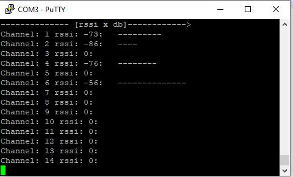

# Cheepest WLAN spectrum analyzer 

This is a simple Guide for a DIY spectrum analyzer with an ESP32 and the Arduino IDE.
The code is based on the work of Łukasz Podkalicki (http://blog.podkalicki.com/esp32-wifi-sniffer/)

# Gui
The gui is a console application, simple to access with Putty for example.

# Source
https://github.com/boschung/WifiSpectrumAnalyzer